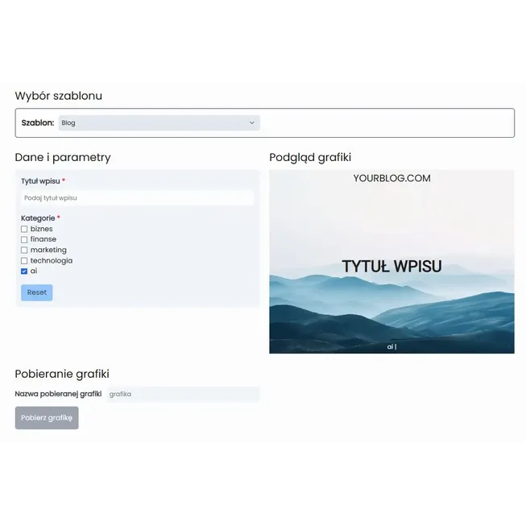

## Geneza projektu

Projekt jest świeży i niedawno powstał. Jest to odpowiedź na zauważony już wcześniej problem, który starałem się rozwiązać w inny sposób ([tworzenie grafik promocyjnych](https://www.lukaszmilos.pl/portfolio/system-tworzenia-grafik-promocyjnych/)).

## Problem

Często tworzone grafiki są bardzo podobne i różnią się tylko tekstem, zdjęciem. Używanie do nich za każdym razem skomplikowanego programu graficznego jest czasochłonne. Co więcej, zauważyłem, że osoby mniej doświadczone często tworzą podobne grafiki, ale jednak niespójne - coś jest większe, coś mniejsze, lekko przesunięte. To nie wygląda profesjonalnie.

## Cel

Postanowiłem zbudować prosty system, by ułatwić do granic możliwości produkowanie podobnych grafik. Celem miała być prostota użytkowania, spójność i w dalszej perspektywie większa liczba publikacji, dzięki prostszemu procesowi.

## Realizacja

### Założenia projektu

Chciałem to zrobić szybko i prosto, bez potrzeby stawiania skomplikowanej infrastruktury. Ważna była także skalowalność rozwiązania i łatwe utrzymanie.

### Technologia

Wybór po raz kolejny padł na **astro** (strona kodowana w nowoczesnej technologii) z użyciem **tailwind.css.**

Strona z natury statyczna została wdrożona przy pomocy **Cloudflare Pages**.

Dzięki temu strona będzie szybka i bezpieczna, bez konieczności aktualizacji i martwienia się o to, czy nadal wszystko działa. To jest naprawdę ważne.

Są jednak dynamiczne elementy projektu zrealizowane przy pomocy biblioteki **react.js** i kilku innych blibliotek.

### Zakres prac

W projekcie wszystko wykonałem samodzielnie od A do Z (zarówno sam landing jak i core systemu):

- opracowanie konspektu
- przygotowanie projektu graficznego
- przygotowanie tekstów
- opracowanie skalowanego systemu dodawania nowych klientów i szablonu
- opracowanie systemu wyboru szablonu, generacji formularza, pobierania zdjęć
- wdrożenie projektu
- konfiguracja domeny i hostingu
- optymalizacja techniczna witryny

### Rzeczy warte odnotowania

- zastosowanie dobrych praktyk
- pełna responywność (dobra czytelność na wszystkich ekranach)
- prostota, czytelność i użyteczność
- możliwość kontaktu poprzez zewnętrzny formularz kontaktowy (tally)
- wysoka skalowalność rozwiązania
- łatwe utrzymanie systemu

### Jak działa system?

#### Perspektywa klienta

1. Klient przedstawia, co chce osiągnąć, jakie grafiki tworzyć, jak się zmieniają.
2. Klient otrzymuje link do swojej podstrony, gdzie ma dostęp do swoich szablonów.
3. Klient wybiera szablon, wpisuje dane i pobiera grafikę, którą może wykorzystać w dowolnym miejscu.

#### System od środka

1. Każdy klient ma swoją dedykowaną podstronę.
2. Każdy klient ma swój katalog w systemie, w tym między innymi listę aktywnych szablonów.
3. Stworzenie nowego szablonu polega na zdefiniowaniu pól (nazw, typów, walidacji) oraz samego widoku w jsx (html, ts, tailwind css).
4. Formularz jest automatycznie tworzony na podstawie definicji pól.
5. Dane z formularza w czasie rzeczywistym trafiają do szablonu. Oprócz danych tekstowych mogą to być zdjęcia, kolory, daty, czy elementy z list.
6. Problem z pobieraniem obiektu html jak zdjęcie, w odpowiedniej skali (niezależnie od wielkości ekranu) udało się rozwiązać po długiej batalii.
7. System cechuje się wysoką skalowalnością, łatwością dodawania nowych klientów i szablonów.

## Wyniki

System nie zyskał jeszcze uznania. Czekam na efekty.
