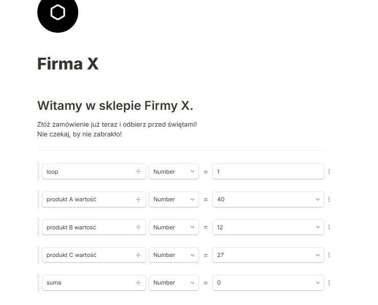
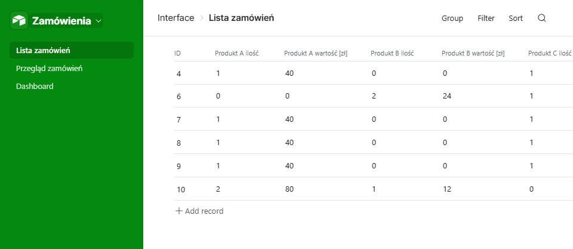
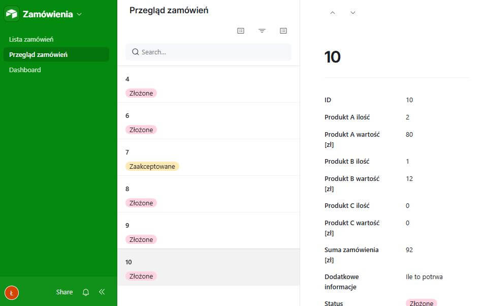
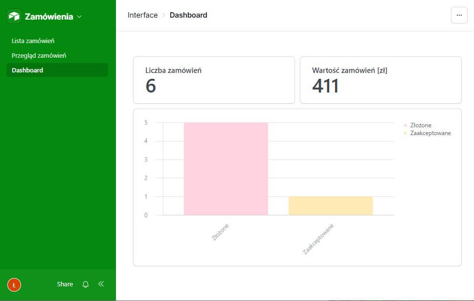

## Geneza projektu

W ostatnim czasie zauważyłem, że coraz więcej osób publikuje informacje o rozpoczęciu zapisów na ciasta, wędliny, itp. na święta. Dostrzegłem, że pojawia się wiele pytań, a zamówienia zbierane są telefoniczne, e-mailowo lub najczęściej w wiadomości prywatnej. Można inaczej.

## Problem

Zbieranie informacji z różnych źródeł, bez odpowiedniego formatu jest trudne i czasochłonne. Problem jest także z przetwarzaniem, bo gdzie te zamówienia są zapisywane? W excelu, na kartce? To dodatkowa warstwa ograniczeń.

## Cel

Postanowiłem zbudować prosty system, by ułatwić proces zbierania, gromadzenia i przetwarzania zamówień. Celem miała być oszczędność czasu dla producentów oraz nowe możliwości wynikające np. z wygodnego systemu bazodanowego i posiadania wszystkich danych w jednym miejscu.

## Realizacja

### Założenia projektu

Jak niemal zawsze - miało być szybko i prosto, jako, że nie wiedziałem czy mój pomysł zyska uznanie. Skupiłem się na meritum, bez dodatkowych funkcji, które "krążyły po głowie".

### Technologia

Postawiłem na 2 dobrze znane mi narzędzia.

**Tally.so** - tworzenie formularzy, z odpowiednią logiką i integracja z airtable.

**Airtable** - system bazodanowy, z panelem przeglądu i modyfikacji zamówień, a także statystykami.

### Jak działa system?

1. Dla każdego producenta przygotowywany jest dedykowany formularz oraz baza danych wraz z dashboardem.

2. Producent w wybranych przez siebie miejscach udostępnia link do formularza, z którego korzystają klienci.

3. Producent sprawdza i przetwarza zamówienia w wygodnym interfejsie airtable.

### Jak powstał system?

#### Przegląd

Wybór dot. technologii padł dość szybko.
Sporo czasu zajęło jednak rozważenie kwestii samej implementacji i kwestii prawnych (zbieranie danych kontaktowych).
Rozważałem implementację zarówno na swoich kontach, jak i bezpośrednio na kontach klientów. W zależności od przypadku potrzebna jest umowa, a formularz przede wszystkim musi zawierać informację, prośbę o zgodę i odrębnie przygotowaną politykę prywatności.

#### Utworzenie formularza w tally.so

Tworzenie formularza jest szybkie i proste, ale drobne problemy pojawiają się, gdy trzeba jednak stworzyć logikę.

Na szczęście tally ma odpowiednie narzędzia, ale wymaga to dość precyzyjnego przygotowania i przewidzenia wielu warunków. Tak było chociażby w kontekście automatycznego przeliczenia wartości produktów.

Im więcej produktów, tym więcej pracy, choć logika jest podobna, o ile nie jednakowa.

Starałem się formularz zrobić możliwie jak najbardziej intuicyjny, stąd wprowadzono:

- automatycznie przeliczane wartości produktów
- automatyczną sumę
- warunkowo pokazywane pola oraz ew. blokowane przyciski przejścia do kolejnego kroku
- sekcję z podsumowaniem

#### Utworzenie bazy danych airtable

Na podstawie oferty i produktów przygotowałam odpowiedni schemat tabeli.

Postanowiłem ponownie przeliczać wartości produktów (zamiast spisywać je z tally.so), aby umożliwić producentowi nie o tyle edycję zamówień, co wprowadzanie zamówień bezpośrednio w systemie, z pominięciem formularza.

Tyczy się to np. wcześniejszych zamówień lub zamówień złożonych telefonicznie, e-mailowo czy w wiadomości prywatnej. Ma to swoją wadę, bo mamy 2 źródła prawdy jeśli chodzi o cenę i w przypadku zmian musimy zadbać o spójność.

Stwierdziłem, że zamiast udostępniać klientowi samą tabelę - lepiej skorzystać z opcji interfejsu, więc przygotowałem kilka widoków, a także utworzyłem podstawowy panel statystyk.

#### Integracja obu systemów

Nadeszła pora na połączenie obu systemów. Na szczęście tally.so ma taką możliwość, by dane z formularza bezproblemowo zapisywać w airtable. Wystarczyło wybrać konto, tabelę i odpowiednio powiązać pola.

## Podsumowanie

System możliwy jest do zastosowania w wielu przypadkach. Widzę też wiele możliwości jakie dzisiaj zapewniają łatwo dostępne bazy danych no-code i będę próbował dalej je wdrażać w mikro i małych firmach.
