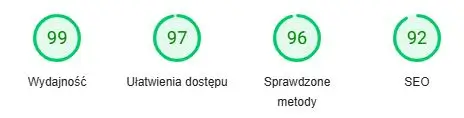

Stronę można zobaczyć tutaj: www.devesol.pl

## Geneza

Projekt modernizacji strony [devesol.pl](https://devesol.pl) rozpoczął się od założenia, że wystarczy nowy design. Początkowo planowaliśmy zachować istniejące treści i tylko przedstawić je w bardziej nowoczesny i czytelny sposób. W trakcie prac okazało się jednak, że zmiany będą znacznie głębsze – zmodyfikowano zarówno strukturę witryny, jak i większość treści, by lepiej działać w przyszłości.

## Problem

Strona była nieco "przestarzała" wizualnie, a niektóre jej elementy trudne w dalszym rozwoju. Potrzeba było zatem świeżości, ale i porządku, by całość była przejrzysta i można było stronę lepiej skalować w przyszłości.

## Cel

Celem było stworzenie nowoczesnej i responsywnej strony internetowej z:

- uporządkowanym systemem zarządzania treścią,
- nowym page builderem,
- czytelnym układem informacji,
- lepszym SEO i wydajnością,
- możliwością łatwej rozbudowy.

## Realizacja

### Design

- **Wstępny układ** oparty na komponentach z [relume.io](https://relume.io) – znacznie ułatwiło to projektowanie poprawnego layoutu
- **Kolorystyka**: żywa zieleń – symbol automatyzacji, świeżości i technologii
- **Typografia**: czcionka Poppins – nowoczesna, lekka i bardzo czytelna
- **Grafiki**: ilustracje z [undraw.co](https://undraw.co) wspierające przekaz
- **Styl**: dużo białej przestrzeni, subtelne animacje `fade-up` pojawiające się w odpowiednim momencie

### System, technologia

Proponowałem wykorzystanie nowoczesnego systemu Astro zamiast wordpressa, ale ostatecznie klient postanowił zostać przy znanej technologii, co jest jak najbardziej zrozumiałe.

Zmieniono jednak page builder: **Elementor ➝ Greenshift**.

Greenshift to nowoczesne, szybkie i elastyczne rozwiązanie oparte na blokach (FSE). To pozwoliło chociażby na redukcję liczby wtyczek z **18 do 14**.

### Zakres prac

- Nowy projekt graficzny
- Przebudowa struktury strony
- Adaptacja i rozbudowa treści
- Nowy page builder - Greenshift
- Wyodrębnienie sekcji **Case Studies** jako osobnej kolekcji
- Usunięcie niepotrzebnych wtyczek
- Optymalizacja systemu WordPress

### Case Studies

Zamiast wcześniejszej jednej, długiej podstrony z dokładnymi opisami, każda realizacja ma teraz swoją dedykowaną stronę. To:

- poprawiło SEO (więcej słów kluczowych, lepsze indeksowanie),
- poprawiło UX (czytelniejsza forma, łatwiejsza nawigacja),
- umożliwiło dalszą rozbudowę portfolio.

Ciągle istnieje główna podstrona z case studies, ale zawiera tylko "zajawki", a meritum znajduje się na dedykowanych podstronach.

Dodawanie i zarządzanie elementami portfolio jest teraz bajecznie proste.

### Migracja

Strona nie była budowana od zera – należało zachować:

- obecną domenę i hosting,
- część wtyczek, pliki medialne i wpisy blogowe.

Aby zapewnić **brak przerw w działaniu**, zdecydowaliśmy się na następujący proces:

1. Utworzenie osobnej instancji deweloperskiej
2. Prace projektowe i testy na oddzielnym środowisku
3. Backup strony produkcyjnej i stworzenie środowiska stagingowego
4. Import danych i konfiguracja Greenshift
5. Testy migracji i finalne porządki
6. Backup + scalanie stagingu z wersją produkcyjną

## Wyniki

- Nowoczesna, przejrzysta i lekka strona internetowa
- Wydajność: 98/100 (mobile), 99/100 (desktop) w Google PageSpeed Insights
- Skuteczna adaptacja dużej ilości merytorycznej treści
- Responsywność i pełna dostępność na urządzeniach mobilnych
- Prostota, funkcjonalność i łatwość użytkowania (greenshift)
- Uporządkowany system WordPress
- Mniejsze ryzyko błędów i awarii – dzięki redukcji zbędnych wtyczek
- Gotowość do dalszej rozbudowy (case studies, nowe usługi)

## Ciekawostki z zaplecza

- **Czas realizacji**: 93 godziny (mierzone w Toggl)
- **Najkrótsza poprawka**: 5 minut – dzięki sprawnej komunikacji z klientem
- **Zarządzanie projektem**: Todoist – zadania podzielone na konkretne etapy i checklisty
- **Redukcja liczby wtyczek**: z 18 do 14 – z potencjałem do dalszego zmniejszenia

## Podsumowanie

To projekt, który pokazuje, że WordPress może być nadal świetną bazą – pod warunkiem dobrego podejścia i uporządkowania systemu. Dzięki sprawnej współpracy z firmą Devesol udało się stworzyć nowoczesną, lekką i skalowalną stronę internetową, która wspiera ich dalszy rozwój i profesjonalny wizerunek.
