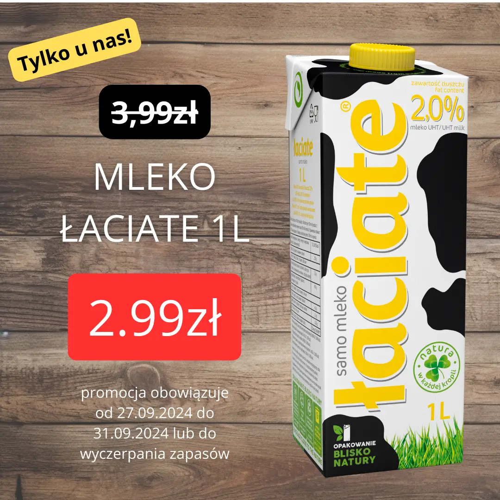
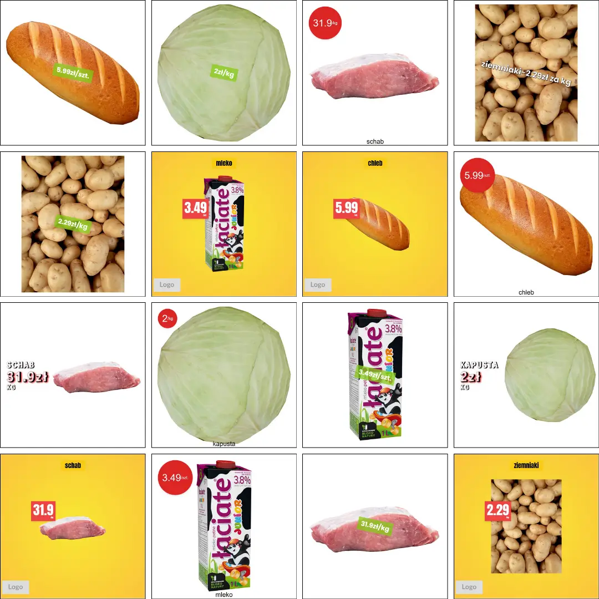

## Geneza projektu

Projekt zrealizowany w sierpniu 2024 roku. Był to mój pomysł. Lokalny sklep w okolicy jest bardzo aktywny w sieci. Publikuje rolki, informacje, ale też całą masę grafik promocyjnych produktów. Rozejrzałem się w sieci po małych sklepach spożywczych i zauważyłem, że one tego nie robią w ogóle lub próbują to robić, ale nie zawsze im to dobrze wychodzi.

## Problem

Dostrzegłem, że tworzenie grafik promocyjnych nie jest takie proste dla małych sklepów spożywczych. Wymaga to czasu i pewnych umiejętności, by było to estetyczne, spójne i profesjonalne. Zauważałem pośpiech w tym działaniu.

## Cel

Celem było zatem uproszczenie tworzenia grafik promocyjnych dla małych sklepów spożywczych, nie tylko tych spoza sieci, bo i pośród tych zauważałem próby rozszerzania reklam.

## Realizacja

### Założenie i opis działania

Założeniem była maksymalna prostota i szybkość. Możliwe to było poprzez zastosowanie przygotowanych szablonów, w porozumieniu ze sklepem. Potem tylko sklep podaje wymagane dane produktu i promocji w formularzu i otrzymuje gotową grafikę promocyjną. Takie proste. W póżniejszym okresie rozważana była także automatyczna publikacja, czy nawet dostosowanie i widok szablonu na żywo, bo w tej wersji działa to trochę w myśl "czarnej skrzyni".

### Rozwiązania techniczne

Potrzebny był zatem formularz / tabela i jakiś silnik szablonów, który generował by szablonowe grafiki na podstawie danych.

Są takie rozwiązania, mógłbym także zastosować Canvę, ale chciałem zrobić coś innego, mając też na uwadzę późniejszy rozwój, jak i chęć wypróbowania pewnych narzędzi.

Ostateczne rozwiązanie jest trochę skomplikowane i działa w sposób półautomatyczny. Wykorzystane narzędzia to:

- **tally.so** - wygodne formularze do wprowadzania danych - mam przygotowany formularz, każdy zapisany sklep ma swoje id, dzięki czemu trafia w odpowiednie miejsce.

- **make.com** - narzędzie do automatyzacji - w tym momencie przechwytuje każdy wpis z tally.so i zapisuje go w tabeli airtable. W drugim scenariuszu o wybranej porze agreguje wszystkie zgłoszenia według sklepu i przygotowuje dla mnie json do dalszego przetwarzania oraz zapisuje pracę do rozliczenia

- **airtable** - baza danych - przechowuje dane pojedynczych zleceń, zagregowane zlecenia, dane sklepu oraz dane rozliczeniowe (ile żądań \* stawka)

- **python (z silnikiem jinja2)** - język programowania - lokalny zestaw skryptów, z odpowiednią konfiguracją i działaniem. To tutaj mam przygotowane szablony html (silnik jinja2), wczytuję plik JSON, zapisuję historyczne zlecenia, tworzę grafiki gotowe do wysłania

### Droga techniczna

- wysłanie żądania wygenerowania grafiki poprzez formularz tally.so (x razy)
- make.com przechwytuje każde żądanie i zapisuje w tabeli airtable
- make.com o wybranej porze agreguje wszystkie żądania wedle ID sklepu, usuwa pojedyncze żądania i tworzy jedno zlecenie z kodem JSON per sklep, a także tworzy nowe rozliczenia
- kopiuję plik JSON do mojego zestawu skryptów, gdzie generuję grafiki
- wysyłam grafiki i aktualizuję status zlecenia w tablicy airtable

### Kwestie warte uwzględnienia

- odpowiednia obsługa plików
- kontrola błędów
- zachowywanie historycznych zleceń

## Kilka zdjęć z efektów działania programu

## Możliwe ulepszenia

- całkowita automatyzacja procesu
- interaktywne tworzenie grafik
- automatyczna wysyłka i publikacja
- tworzenie szablonowych broszur i gazetek

## Wyniki

Projekt nie odniósł na ten moment sukcesu, mimo kontaktu z kilkudziesięcioma sklepami. Ale to jeszcze nie koniec.

Osobiście sporo nauczyłem się na temat wykorzystywanych narzędzi i procesu tworzenia.
