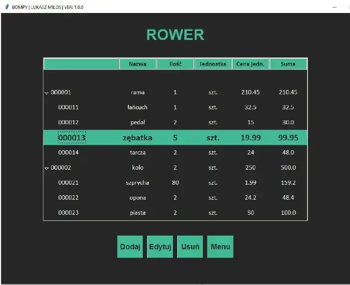

## Geneza projektu

Projekt miał miejsce 2022 roku i był to projekt studencki na zaliczenie przedmiotu.

## Problem

Wyzwaniem była realizacja projektu w krótkim czasie i to w stosunkowo nowej dla mnie technologii.

## Cel

Wykonanie projektu, zaliczenie przedmiotu, faktyczne ułatwienie tworzenia zestawienia materiałówego (BOM) oraz zyskanie doświadczenia technicznego.

## Realizacja

### Krótkie wyjaśnienie zestawienia materiałowego

BOM (Bill Of Materials) jest strukturalnym zestawieniem materiałowym produktu końcowego, czyli listą części składowych (wraz z określeniem ich cech). Czasami zawiera też listę czynności niezbędnych do jego powstania.

### Założenia

Założeniem było skupienie się na liście części, łatwym dodawaniu i edycji oraz kontroli i prezentacji struktury w formie drzewa. System miał być prosty i niezależny od innego oprogramowania.

### Wybór technologii

W wyborze technologii miałem wolną rękę. W tym czasie mocno interesowałem się python i realizowałem też proste skrypty, więc postawiłem na niego.

Trzeba było jednak znaleźć bibliotekę, która umożliwia tworzenie interfejsu graficznego. Tym razem, zamiast na QT, postawiłem na prostą bibliotekę tkinter.

### Zaimplementowane funkcje

- zarządzanie plikami JSON
- CRUD dla produktów, elementów (zagnieżdżona struktura)
- walidacja danych wejściowych i obsługa błędów
- prezentacja danych w formie rozwijanego i zagnieżdżonego "drzewa"
- intuicyjny i minimalistyczny interfejs

### Kilka zdjęć z interfejsu programu

## Wyniki

Wiele rzeczy nie było prostych do realizacji w tym projekcie, ze względu na nowość zagadnień. Udało się jednak ostatecznie opracować ciekawe i skuteczne rozwiązanie.

Dodatkowo w ramach projektu stworzono dość obszerną dokumentację, a projekt został oceniony na 5.0. Zyskałem także nową wiedzę i cenne doświadczenie.
