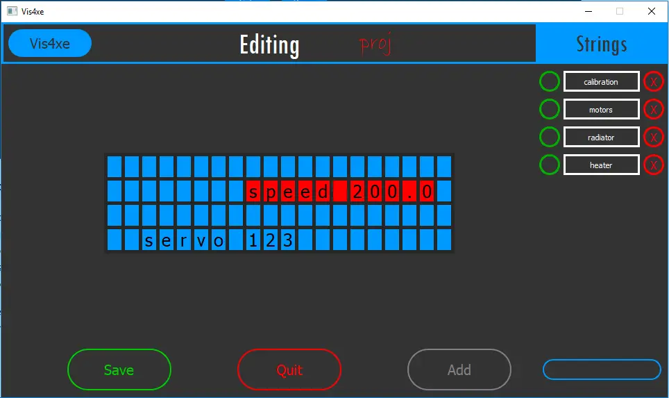
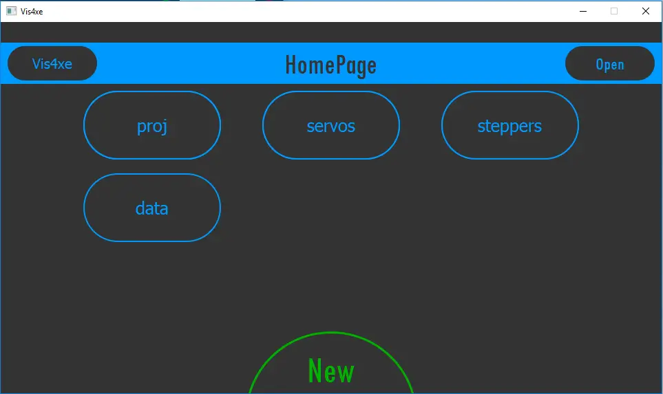
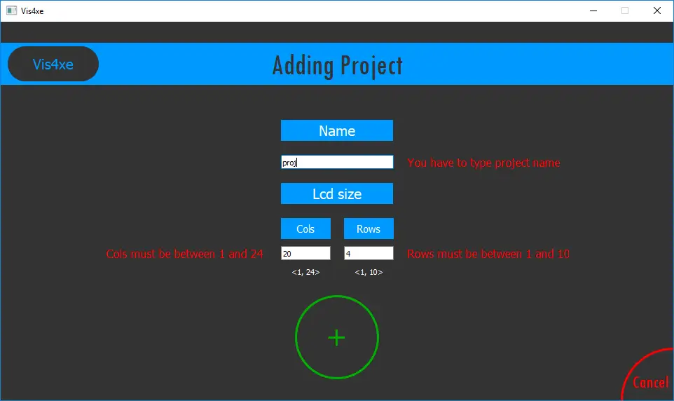

## Geneza projektu

Projekt miał miejsce w lutym 2019 roku. Troszkę wcześniej realizowałem pewien projekt embedded z użyciem arduino i wyświetlacza segmentowego i szykował się następny. Powodem, dla któreg go zrealizowałem była więc własna potrzeba optymalizacji.

## Problem

Problemem, który napotkałem przy pierwszym projekcie było trudne i czasochłonne planowanie i programowanie wyświetlacza na arduino. Zarządzanie napisami, pozycjami i ich wyświetlaniem było po prostu trudne.

## Cel

Postanowiłem zbudować aplikację, dzięki, której ja i inni będą mogli prościej i szybciej budować swoje programy z użyciem wyświetlacza. Aplikacja z założenia miała być graficzna (drag & drop) i generować kod gotowy do "wrzucenia" na arduino.

## Realizacja

### Wybór technologii

Poszukiwałem rozwiązania, które pozwoli w sposób relatywnie prosty stworzyć aplikacji graficzną.
Postawiłem na QTcreator (bibliotekę QT), z programowaniem w języku C++

### Zaimplementowane funkcje

- zarządzanie plikami I/O (json i txt)
- funkcja drag & drop dla napisów
- przemieszczanie napisów na ekranie
- CRUD dla projektów i napisów
- zarządzanie projektami i napisami
- walidacja danych
- generowanie kodu C++ dla arudino

### Kilka zdjęć z interfejsu programu

## Wyniki

Wiele rzeczy nie było prostych do realizacji w tym projekcie, ze względu na nowość zagadnień. Udało się jednak ostatecznie opracować ciekawe i skuteczne rozwiązanie.

Dzięki temu o średnio 20% szybicej zaprogramowałem wyświetlacz
w kolejnym projekcie. Co więcej, sporo się nauczyłem i zdobyłem nowe umiejętności.
