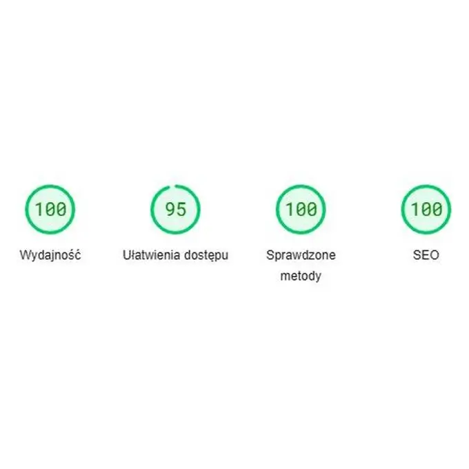

## Geneza projektu

Projekt jest świeżutki (luty 2025) i jest moją odpowiedzią na zauważony problem.

## Problem

Problemu doświadczyłem na własnej skórze. Pewnego razu chciałem zamówić pizzę, a mieszkam w małej miejscowości. Lokale nie mają stron internetowych, tylko facebooka. Na jednym nie znalazłem menu w ogóle, a na drugim było ono bardzo małe i niewyraźne. Jak tu zamówić?

## Cel

Postanowiłem zbudować prosty system do stawiania mini-stronek z menu dla chętnych restauracji i pizzerii, **by rozwiązać problem dostepności i czytelności menu, ułatwić życie klientom, a poprawić jakość obsługi i być może liczbę klientów restauracjom.**

## Realizacja

### Założenia projektu

Pewnie wielu osobom projekt wydaje się bez sensu. Przecież dzisiaj mamy łatwy dostęp do stron internetowych, systemów POS, dostawców, a nawet własnych aplikacji. Jednak z jakiegoś powodu restauracje ich nie mają.

Prawopodobnym powodem jest koszt, brak czasu lub niechęć, co do wdrażania, dużych zmian procesów i realizacji. Trzeba się dość mocno zaangażować.

Postanowiłem stworzyć coś prostego, za ułamek ceny i nie wymagającego ich dużego zaangażowania. Z drugiej strony musiało to być dla mnie proste w obsłudze i utrzymaniu.

### Technologia

Wybór padł na **astro** (strona kodowana w nowoczesnej technologii) z użyciem **tailwind.css.**

Strona statyczna została wdrożona przy pomocy **Cloudflare Pages**.

Dzięki temu strona będzie szybka i bezpieczna, bez konieczności aktualizacji i martwienia się o to, czy nadal wszystko działa. To jest naprawdę ważne.

Jako formularz skorzystano z zewnętrznego narzędzia **Tally.so**, a do analityki super, proste i bezpieczne pod względem prywatności rozwiązanie - **Simple Analytics**.

### Zakres prac

W projekcie wszystko wykonałem samodzielnie od A do Z:

- opracowanie konspektu
- przygotowanie projektu graficznego
- przygotowanie tekstów
- opracowanie przepływu z OCR, AI, własnych typów treści
- wdrożenie projektu
- konfiguracja domeny i hostingu
- wdrożenie prostej analityki
- optymalizacja techniczna witryny

### Rzeczy warte odnotowania

- wysoka wydajność strony
- zastosowanie dobrych praktyk
- pełna responywność (dobra czytelność na wszystkich ekranach)
- prostota, czytelność i użyteczność - skupienie na problemie i rozwiązaniu, z przedstawieniem historii
- możliwość kontaktu poprzez zewnętrzny formularz kontaktowy
- sekcje FAQ (pytań i odpowiedzi)
- wysoka skalowalność rozwiązania

### Opis procesu myślowego i decyzji

W projekcie postawiłem na prostotę wzorem największym marek i postów na wielu platformach. Skupiłem się przede wszystkim na treści, przedstawieniu problemu, rozwiązania i zalet oraz rozwjaniu wszelkich wątpliwości.

Zastosowana czcionka bardzo ułatwia czytanie. Nagłówki wzbogacono emotikonami.

Wybrana kolorystyka to ciepłe żółte barwy, dobrze znane gastronomii.

Całość bardzo fajnie się czyta i przegląda.

### Jak działa menu?

Występuje podział. Strona główna to landing page opisujący problem i rozwiązanie.

Każda chętna restauracja dostanie własną podstronę w serwisie, na której oprócz samego menu (z przyciskiami sekci) znajduje się sekcja kontaktowa i możliwość dzwonienia.

Strona w zależności od potrzeb może być indeksowana lub nie. Jest ona zoptymalizowana pod kątem wydajności i SEO. Właściciel link może załączyć gdziekolwiek chce - na facebooku, na profilu firmowych w Google lub wygenerować QRcode.

W tym momencie menu zarządzane jest przeze mnie, choć rozważam oddanie obsługi w ręce właścicieli. Menu zapisane jest w formacie json, co znacząco ułatwia jego zarządzenie i aktualizację.

Aktualnym wyzwaniem jest konwersja klasycznego menu i konwersja go do strony internetowej. Korzystam z technik OCR i sztucznej inteligencji, które wspierają mnie w odczytaniu danych, odpowiednim zapisaniu w strukturze i samej prezentacji.

## Wyniki

Strona nie została jeszcze w pełni zaindeksowana w Google, ale analityka już działa.

Jestem bardzo zadowolony z finalnego efektu prac. W planach mam także prace rozwojowe, jeśli projekt się przyjmie.

Teraz czekam na efekty.
